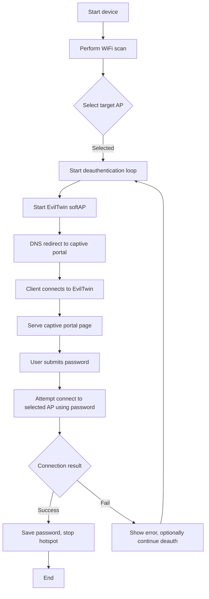
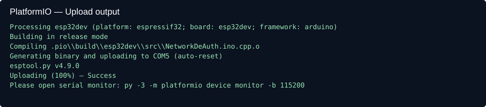
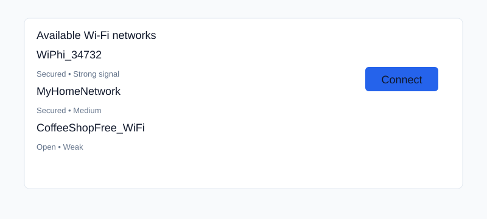
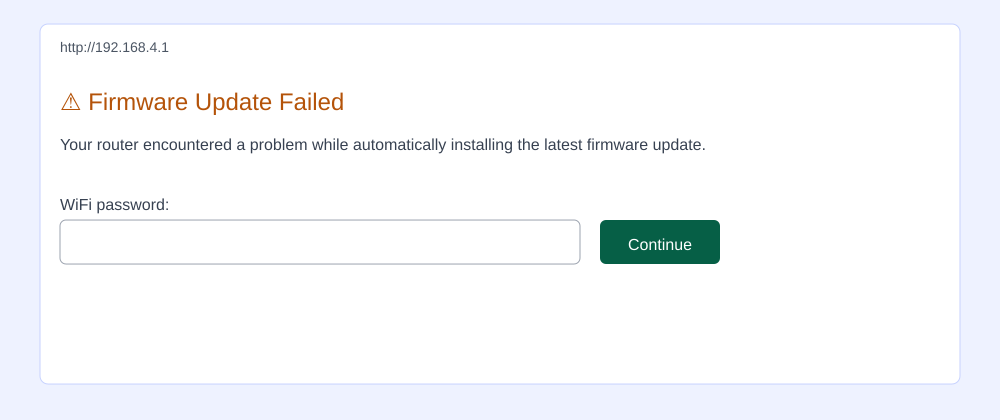
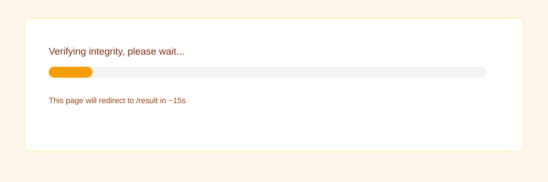
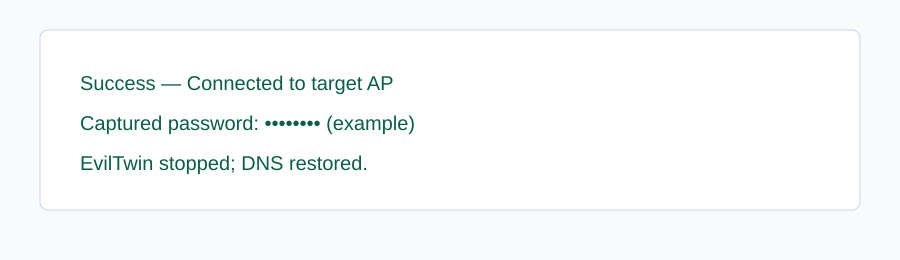
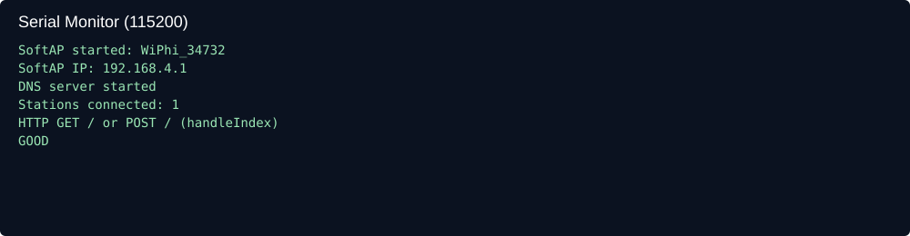
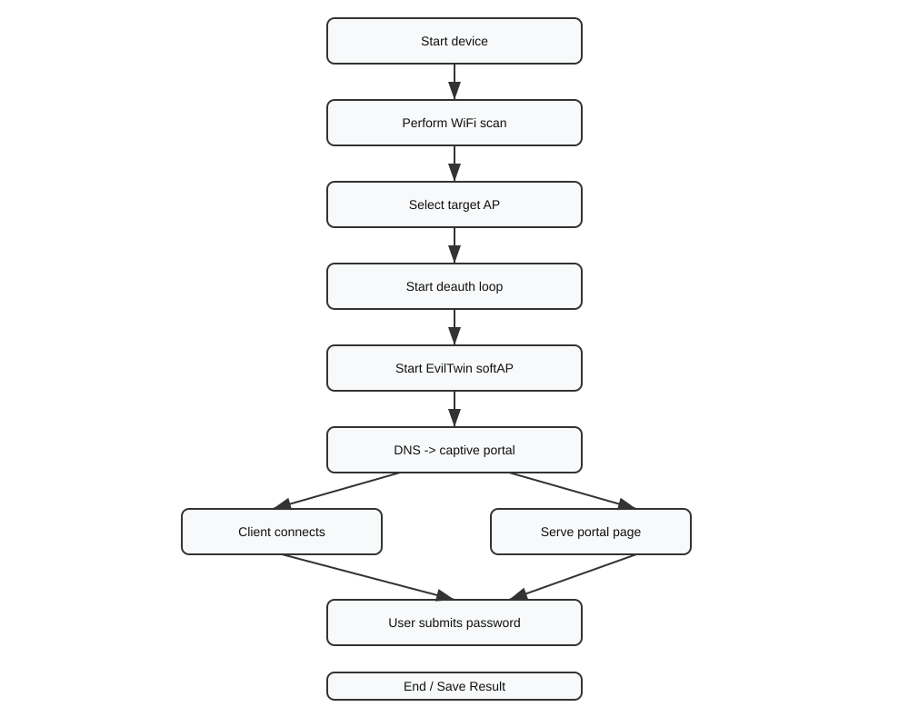

# ESP32 Captive Portal — PlatformIO (Clean Guide)

Ringkasan singkat
- Firmware Arduino untuk ESP32 yang menyediakan captive-portal, scanning, dan utility lainnya. Proyek ini sudah diadaptasi untuk PlatformIO—kode utama ada di `src/NetworkDeAuth.ino`.

Files penting
- `platformio.ini` — konfigurasi PlatformIO.
- `src/NetworkDeAuth.ino` — firmware utama.
- `scripts/` — helper PowerShell: `upload.ps1`, `upload_and_monitor.ps1`.

Persiapan singkat (Windows)
1. Pastikan Python 3 terpasang: `py -3 --version`.
2. Install PlatformIO (pilih salah satu):
   - Cepat: `py -3 -m pip install --user platformio` lalu `py -3 -m platformio --version`.
   - Rekomendasi: `py -3 -m pip install --user pipx` lalu `pipx install platformio`.

Build / Upload / Monitor
```powershell
# compile
py -3 -m platformio run -e esp32dev

# upload (ganti COM sesuai perangkat Anda atau tekan Enter pada script untuk auto-detect)
py -3 -m platformio run -e esp32dev -t upload --upload-port COM5

# serial monitor
py -3 -m platformio device monitor -b 115200
```

Quick helpers
- `.\scripts\upload.ps1` — prompt untuk port (atau tekan Enter untuk auto-detect) dan upload.
- `.\scripts\upload_and_monitor.ps1` — upload lalu buka serial monitor.

Cara mengakses captive portal
1. Sambungkan perangkat ke SSID ESP32 (default: `WiPhi_34732`, password: `d347h320`).
2. Buka browser ke `http://192.168.4.1` (paksa HTTP dengan `http://neverssl.com` jika browser mencoba HTTPS otomatis).

Contoh output serial (debugging)
```
SoftAP started: WiPhi_34732
SoftAP IP: 192.168.4.1
DNS server started
Stations connected: 1
HTTP GET / or POST / (handleIndex)
GOOD
```

## Cara Kerja (Diagram alur)
Gunakan diagram Mermaid ini (GitHub mendukung Mermaid di README):



## Tampilan contoh / Mockup

Halaman captive-portal (mockup teks):

```
+-----------------------------------------------------------+
| ⚠ Firmware Update Failed                                   |
| Your router encountered a problem...                        |
|                                                             |
| WiFi password: [__________] [Continue]                     |
+-----------------------------------------------------------+
```

Halaman admin (mockup tabel):

```
+-----------------------------------------------------------------------+
| SSID             | BSSID              | Channel | Action               |
|----------------------------------------------------------|-----------|
| MyHomeNetwork     | AA:BB:CC:DD:EE:FF  | 6       | [Select]             |
| CoffeeShopFree_WiFi| 11:22:33:44:55:66  | 11      | [Selected]           |
+-----------------------------------------------------------------------+
```

### Screenshots langkah demi langkah

1) Output upload (PlatformIO)



2) Sambungkan ke SSID `WiPhi_34732` (contoh daftar Wi‑Fi)



3) Buka browser ke `http://192.168.4.1` — captive portal



4) Setelah submit: halaman verifikasi (redirect ke `/result`)



5) Hasil sukses (contoh tampilan hasil)



6) Output serial monitor yang relevan



Diagram flowchart telah dirender dan disimpan di `assets/flowchart.svg` — tampilan disematkan di bawah.




Preview animasi alur (animated SVG):


## Aturan Penggunaan (penting)
- Lakukan pengujian hanya pada perangkat atau jaringan yang Anda miliki atau jika Anda memiliki izin tertulis dari pemilik.
- Jangan menyimpan, menyebarkan, atau mengeksfiltrasi kredensial/data sensitif tanpa izin eksplisit.
- Gunakan lingkungan lab/isolated testbed saat menguji fitur deauthentication atau captive-portal.
- Patuhi hukum dan kebijakan lokal.
- Laporkan kerentanan secara bertanggung jawab (responsible disclosure).

---

Render animated preview (GIF)
Prerequisites: Node.js (npm), `ffmpeg` in PATH.

1. Install puppeteer (if you didn't):

```powershell
npm install puppeteer --no-save
```

2. Run the PowerShell helper to produce GIF (default 8s, 15 fps):

```powershell
.\scripts\export_preview.ps1
```

Output: `assets/preview_flow.gif` (and temporary frames in `./tmp_preview_frames`).

